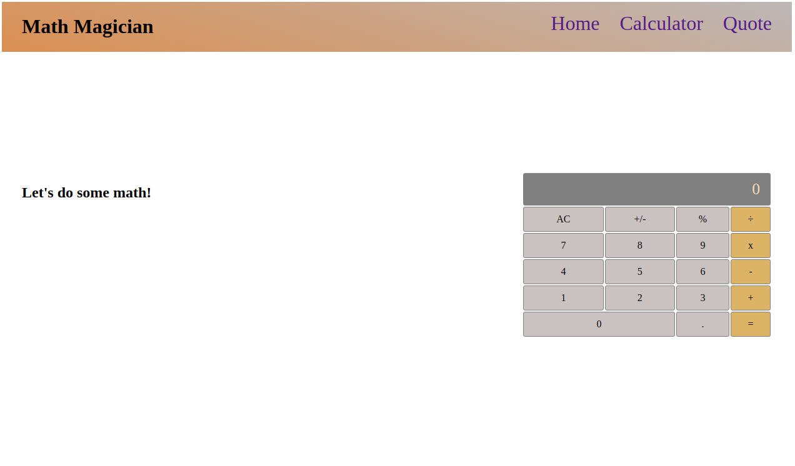

# Math Magician React App

This application is a basic calculator, it demonstrates React library skills beside JSX and CSS.

## Built With

- JavaScript
- React
- HTML
- CSS
- Webpack
- Eslint
- Webhint
- Stylelint

## Getting Started

To get a local copy up and running follow these simple example steps.

`git clone https://github.com/Rayan84/math-magician.git`

### Installation

then to install the project dependencies run

`npm install`

### Deployment

to build:

`npm start`

in your browser open http://localhost:3000/

## Authors

👤 **Rayan Rassam**

- GitHub: [@Rayan84](https://github.com/Rayan84)
- Twitter: [@Rayan65096267](https://twitter.com/Rayan65096267)
- LinkedIn: [Rayan Rassam](https://www.linkedin.com/in/rayan-rassam/)

## 🤝 Contributing

Contributions, issues, and feature requests are welcome!

Feel free to check the [issues page](../../issues/).

## Show your support

Give a ⭐️ if you like this project!

## Acknowledgments

- Microverse